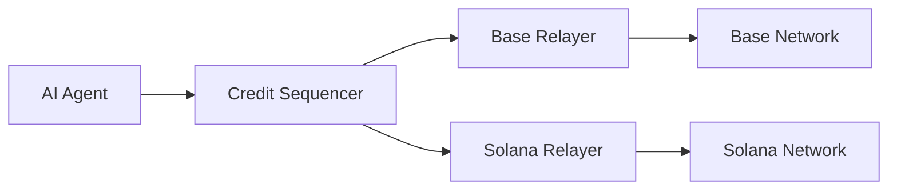

## Overview

Shielded x402 supports multiple blockchain networks through a unified credit sequencer and chain-specific payment relayers. This architecture enables AI agents to make payments across different chains using a single credit balance.

## Supported Chains

### Base (EVM)

- **Chain ID**: `8453` (Mainnet), `84532` (Sepolia Testnet)
- **Chain Reference**: `eip155:8453`, `eip155:84532`
- **Asset**: Native ETH transfers
- **Integration**: EVM-compatible via viem

[Learn more about Base/EVM integration →](/chains/base-evm)

### Solana

- **Network**: Devnet (MVP target)
- **Chain Reference**: `solana:devnet`
- **Asset**: SOL (native)
- **Integration**: Custom x402_gateway program with ZK verification

[Learn more about Solana integration →](/chains/solana)

## Architecture

### Unified Credit System

The credit sequencer maintains a single balance per agent that can be used across all supported chains:

```typescript
const client = new MultiChainCreditClient({
  sequencerUrl: 'https://sequencer.example.com',
  relayerUrls: {
    'eip155:8453': 'https://base-relayer.example.com',
    'solana:devnet': 'https://solana-relayer.example.com'
  }
});

// Credit the agent once
await client.adminCredit({
  agentId: 'agent_abc123',
  amountMicros: '5000000' // 5 USD equivalent in micros
});
```

### Chain-Specific Relayers

Each supported chain has a dedicated payment relayer that:

1. Receives authorized payment requests from the sequencer
2. Executes the payment on the target chain
3. Reports execution results back to the sequencer



### Payment Flow

1. **Intent Creation**: Agent creates a payment intent specifying `requiredChainRef`
2. **Authorization**: Sequencer validates and authorizes the intent
3. **Relay**: Authorization is sent to the chain-specific relayer
4. **Execution**: Relayer executes the payment on the target chain
5. **Reporting**: Relayer reports `executionTxHash` back to sequencer

## Chain References

Chain references follow the [CAIP-2](https://github.com/ChainAgnostic/CAIPs/blob/master/CAIPs/caip-2.md) standard:

| Chain | Reference | Description |
|-------|-----------|-------------|
| Base Mainnet | `eip155:8453` | Production Base network |
| Base Sepolia | `eip155:84532` | Base testnet |
| Solana Devnet | `solana:devnet` | Solana development network |

## Configuration

### Sequencer

The sequencer must be configured with supported chain references:

```bash
export SEQUENCER_SUPPORTED_CHAIN_REFS="eip155:8453,solana:devnet"
```

Defaults to `['eip155:8453', 'solana:devnet']` if not specified.

### Relayers

Each relayer is configured with its chain reference and payout mode:

**Base Relayer:**
```bash
export RELAYER_CHAIN_REF="eip155:84532"
export RELAYER_PAYOUT_MODE="evm" # or "noop" for testing
export RELAYER_EVM_PRIVATE_KEY="0x..."
```

**Solana Relayer:**
```bash
export RELAYER_CHAIN_REF="solana:devnet"
export RELAYER_PAYOUT_MODE="solana"
export SOLANA_GATEWAY_PROGRAM_ID="..."
export SOLANA_PAYER_KEYPAIR_PATH="./keypair.json"
```

## Multi-Chain Example

See the [multi-chain example](https://github.com/your-repo/tree/main/examples/multi-chain-base-solana) for a complete flow demonstrating payments across both Base and Solana using the same agent credit balance.

```typescript
// Create intents for both chains
const baseIntent: IntentV1 = {
  version: 1,
  agentId,
  agentPubKey,
  signatureScheme: 'ed25519-sha256-v1',
  agentNonce: '0',
  amountMicros: '1500000',
  merchantId: baseMerchantId,
  requiredChainRef: 'eip155:8453',
  expiresAt: String(now + 300),
  requestId: randomHex32()
};

const solanaIntent: IntentV1 = {
  version: 1,
  agentId,
  agentPubKey,
  signatureScheme: 'ed25519-sha256-v1',
  agentNonce: '1',
  amountMicros: '2500000',
  merchantId: solanaMerchantId,
  requiredChainRef: 'solana:devnet',
  expiresAt: String(now + 300),
  requestId: randomHex32()
};

// Both will deduct from the same credit balance
const baseAuth = await client.authorize({ intent: baseIntent, agentSig });
const solanaAuth = await client.authorize({ intent: solanaIntent, agentSig });
```

## Next Steps

<CardGroup cols={2}>
  <Card title="Base/EVM Integration" icon="ethereum" href="/chains/base-evm">
    Learn how to configure and use the Base/EVM adapter
  </Card>
  <Card title="Solana Integration" icon="link" href="/chains/solana">
    Deploy and configure the Solana gateway program
  </Card>
</CardGroup>
