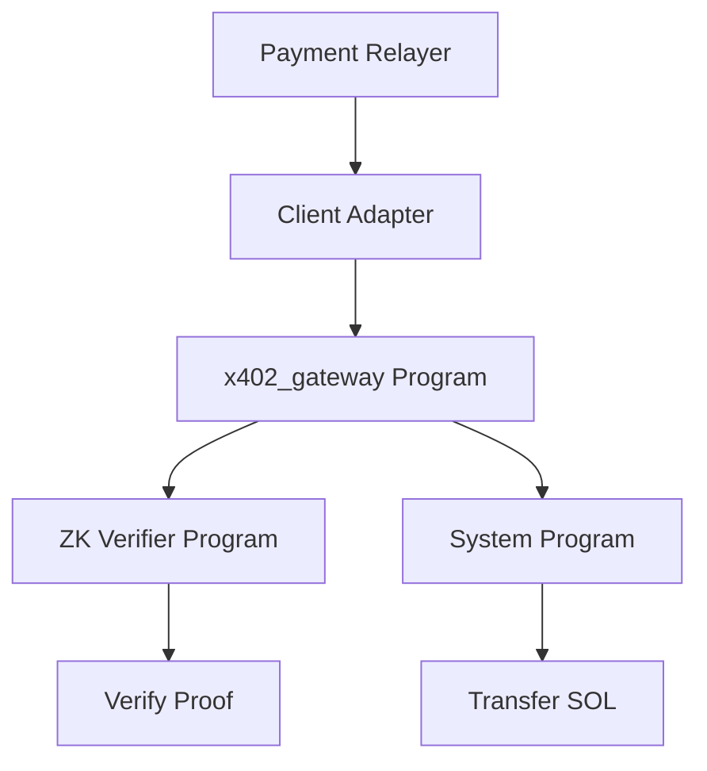

## Overview

The Solana integration provides a complete on-chain payment gateway with zero-knowledge proof verification. It uses a custom Solana program (`x402_gateway`) that integrates with a Groth16 verifier deployed via Sunspot.

## Architecture

The Solana integration consists of three main components:

1. **SMT Exclusion Circuit**: Noir circuit proving a payer is not blacklisted
2. **x402_gateway Program**: Native Solana program handling payment authorization and execution
3. **Client Adapter**: TypeScript helpers for relayer-side transaction submission



### Directory Structure

```
chains/solana/
├── circuits/smt_exclusion/     # Noir ZK circuit
│   ├── src/main.nr             # Circuit source
│   ├── Nargo.toml              # Noir config
│   └── target/                 # Generated proofs and witnesses
├── programs/x402_gateway/      # Solana program
│   ├── src/lib.rs              # Gateway implementation
│   └── Cargo.toml              # Rust dependencies
├── client/                     # TypeScript adapter
│   ├── adapter.ts              # Transaction helpers
│   └── encoding.ts             # Data encoding utilities
└── scripts/                    # Deployment scripts
    ├── deploy-verifier.sh
    ├── deploy-gateway.sh
    └── init-gateway.ts
```

## Gateway Program

The `x402_gateway` program is a native Solana program that manages payment authorization and settlement.

### Program ID

```rust:chains/solana/programs/x402_gateway/src/lib.rs
solana_program::declare_id!("6F2rv4dbwJ7A3F9Q8NpL6X2kYQ6Zxj2Y8ywmupfHP2aG");
```

<Note>
  This is the default program ID. When you deploy, you'll get a new program ID specific to your deployment.
</Note>

### State Account

The gateway uses a Program Derived Address (PDA) to store state:

```rust
const STATE_SIZE: usize = 8 + 32 + 32 + 32; // 104 bytes

// State structure:
// - discriminator: [u8; 8]     ("x402_smt")
// - admin: Pubkey              (32 bytes)
// - smt_root: [u8; 32]         (32 bytes)
// - verifier_program: Pubkey   (32 bytes)
```

### Instructions

The gateway supports three instructions:

#### 1. Initialize State

```rust
pub const INITIALIZE_STATE: u8 = 0;
```

Creates the state PDA and sets the verifier program ID.

**Accounts:**
- `[signer, writable]` admin
- `[writable]` state_account (PDA)
- `[]` system_program

**Data:**
- `verifier_program_id: [u8; 32]`

#### 2. Set SMT Root

```rust
pub const SET_SMT_ROOT: u8 = 1;
```

Updates the Sparse Merkle Tree root used for exclusion proofs.

**Accounts:**
- `[signer]` admin
- `[writable]` state_account (PDA)

**Data:**
- `smt_root: [u8; 32]`

#### 3. Pay Authorized

```rust
pub const PAY_AUTHORIZED: u8 = 2;
```

Executes a payment after verifying the ZK proof.

**Accounts:**
- `[signer, writable]` payer
- `[writable]` recipient
- `[]` state_account
- `[]` verifier_program
- `[]` system_program

**Data (512 bytes total):**
- `auth_id: [u8; 32]` - Authorization ID
- `amount_lamports: u64` - Transfer amount
- `auth_expiry_unix: u64` - Expiration timestamp
- `proof: [u8; 388]` - Groth16 proof
- `public_witness: [u8; 76]` - Public inputs

### Error Codes

```rust
pub enum GatewayError {
    InvalidDataLength = 0,
    InvalidStateAccount = 1,
    SmtRootMismatch = 2,
    InvalidStatePda = 3,
    InvalidZkVerifier = 4,
    AuthorizationExpired = 5,
}
```

## ZK Circuit

The SMT exclusion circuit proves that a payer is not on the blacklist.

### Circuit Location

```
chains/solana/circuits/smt_exclusion/
├── src/main.nr          # Noir circuit source
├── Nargo.toml           # Circuit configuration
├── Prover.toml          # Prover inputs
└── target/              # Build artifacts
    ├── smt_exclusion.proof     # Groth16 proof (388 bytes)
    ├── smt_exclusion.pw        # Public witness (76 bytes)
    ├── smt_exclusion.vk        # Verification key
    └── smt_exclusion.json      # Circuit JSON
```

### Proof Format

The circuit generates:

- **Proof**: 388 bytes (Groth16 proof for Solana)
- **Public Witness**: 76 bytes containing:
  - Bytes 12-44: SMT root (32 bytes)
  - Other public inputs

```typescript:chains/solana/client/adapter.ts
const SOLANA_PROOF_LEN = 388;
const SOLANA_WITNESS_LEN = 76;
```

## Deployment

### Prerequisites

1. **Solana CLI** installed and configured
2. **Anchor framework** (optional, for development)
3. **Noir toolchain** (`nargo`, `sunspot`)
4. **Node.js** and pnpm
5. **Solana wallet** with devnet SOL

### Environment Variables

```bash
# Required
export SOLANA_DEPLOYER_KEYPAIR="path/to/deployer-keypair.json"
export SOLANA_CLUSTER="devnet"
export SOLANA_ADMIN_KEYPAIR_PATH="path/to/admin-keypair.json"
export GNARK_VERIFIER_BIN="path/to/sunspot/verifier-bin"

# Optional
export SOLANA_RPC_URL="https://api.devnet.solana.com"
export SOLANA_WS_URL="wss://api.devnet.solana.com"
```

### Step 1: Install Dependencies

```bash
pnpm --dir chains/solana/client install
```

### Step 2: Deploy Verifier

Deploy the Groth16 verifier program using Sunspot:

```bash
pnpm solana:deploy:verifier
# or directly:
bash chains/solana/scripts/deploy-verifier.sh
```

This will output:
```
Verifier program deployed: VerifyProgramID123...
```

Save this program ID for the next step.

### Step 3: Deploy Gateway

```bash
pnpm solana:deploy:gateway
# or:
bash chains/solana/scripts/deploy-gateway.sh
```

Output:
```
Gateway program deployed: GatewayProgramID456...
```

### Step 4: Initialize Gateway

Set the verifier program ID and SMT root:

```bash
export SOLANA_GATEWAY_PROGRAM_ID="GatewayProgramID456..."
export SOLANA_VERIFIER_PROGRAM_ID="VerifyProgramID123..."

pnpm solana:init:gateway
# or:
pnpm tsx chains/solana/scripts/init-gateway.ts
```

The script will:

1. Derive the state PDA automatically
2. Create and initialize the state account
3. Set the SMT root from:
   - `SOLANA_SMT_ROOT_HEX` environment variable, or
   - Extract from `chains/solana/circuits/smt_exclusion/target/smt_exclusion.pw`

Output:
```
[solana] gateway init inputs
rpcUrl=https://api.devnet.solana.com
gatewayProgramId=Gateway...
verifierProgramId=Verifier...
adminAddress=Admin...
stateAccount=State...
smtRootHex=0x1234...
[solana] InitializeState tx=5YNmS3...
[solana] SetSmtRoot tx=3kQpA7...
[solana] ready state account: StateAccount...
```

Save the `stateAccount` address for relayer configuration.

## Client Adapter

The TypeScript adapter provides three functions for interacting with the gateway:

### 1. `submitInitializeState`

```typescript
import { submitInitializeState } from './chains/solana/client/adapter';

const result = await submitInitializeState({
  rpcUrl: 'https://api.devnet.solana.com',
  wsUrl: 'wss://api.devnet.solana.com',
  gatewayProgramId: 'Gateway...' as Address,
  verifierProgramId: 'Verifier...' as Address,
  stateAccount: 'State...' as Address,
  payerKeypairPath: './admin-keypair.json'
});

console.log('Initialized:', result.txSignature);
```

### 2. `submitSetSmtRoot`

```typescript
import { submitSetSmtRoot } from './chains/solana/client/adapter';

const result = await submitSetSmtRoot({
  rpcUrl: 'https://api.devnet.solana.com',
  wsUrl: 'wss://api.devnet.solana.com',
  gatewayProgramId: 'Gateway...' as Address,
  stateAccount: 'State...' as Address,
  smtRootHex: '0x1234567890abcdef...' as `0x${string}`,
  payerKeypairPath: './admin-keypair.json'
});

console.log('Root updated:', result.txSignature);
```

### 3. `submitPayAuthorized`

```typescript
import { submitPayAuthorized } from './chains/solana/client/adapter';
import fs from 'node:fs';

const proof = fs.readFileSync('./target/smt_exclusion.proof');
const publicWitness = fs.readFileSync('./target/smt_exclusion.pw');

const result = await submitPayAuthorized({
  rpcUrl: 'https://api.devnet.solana.com',
  wsUrl: 'wss://api.devnet.solana.com',
  gatewayProgramId: 'Gateway...' as Address,
  verifierProgramId: 'Verifier...' as Address,
  stateAccount: 'State...' as Address,
  recipient: 'Recipient...' as Address,
  amountLamports: 1_000_000n, // 0.001 SOL
  authIdHex: '0xabcdef...' as `0x${string}`,
  authExpiryUnix: BigInt(Math.floor(Date.now() / 1000) + 300),
  proof: proof,
  publicWitness: publicWitness,
  computeUnits: 1_000_000, // Optional, defaults to 1M
  payerKeypairPath: './payer-keypair.json'
});

console.log('Payment executed:', result.txSignature);
```

### Data Encoding

The adapter uses little-endian encoding for Solana compatibility:

```typescript:chains/solana/client/encoding.ts
export function u64ToLeBytes(value: bigint): Uint8Array {
  const out = new Uint8Array(8);
  const view = new DataView(out.buffer);
  view.setBigUint64(0, value, true); // true = little-endian
  return out;
}

export function buildPayAuthorizedData(input: {
  authIdHex: `0x${string}`;
  amountLamports: bigint;
  authExpiryUnix: bigint;
  proof: Uint8Array;
  publicWitness: Uint8Array;
}): Uint8Array {
  const authId = authIdToBytes(input.authIdHex);
  const amount = u64ToLeBytes(input.amountLamports);
  const expiry = u64ToLeBytes(input.authExpiryUnix);
  
  const out = new Uint8Array(32 + 8 + 8 + input.proof.length + input.publicWitness.length);
  out.set(authId, 0);
  out.set(amount, 32);
  out.set(expiry, 40);
  out.set(input.proof, 48);
  out.set(input.publicWitness, 48 + input.proof.length);
  
  return out;
}
```

## Payment Relayer Configuration

Configure the Solana relayer with the deployed gateway:

```bash
# Chain configuration
export RELAYER_CHAIN_REF="solana:devnet"
export RELAYER_PAYOUT_MODE="solana"

# Gateway configuration
export SOLANA_RPC_URL="https://api.devnet.solana.com"
export SOLANA_WS_URL="wss://api.devnet.solana.com"
export SOLANA_GATEWAY_PROGRAM_ID="Gateway..."
export SOLANA_VERIFIER_PROGRAM_ID="Verifier..."
export SOLANA_STATE_ACCOUNT="State..."
export SOLANA_PAYER_KEYPAIR_PATH="./payer-keypair.json"

# Proof artifacts
export SOLANA_PROOF_PATH="chains/solana/circuits/smt_exclusion/target/smt_exclusion.proof"
export SOLANA_PUBLIC_WITNESS_PATH="chains/solana/circuits/smt_exclusion/target/smt_exclusion.pw"

# Optional
export SOLANA_COMPUTE_UNITS_LIMIT="1000000"
```

## Merchant Request Payload

When using the payment relayer for Solana, the merchant request body should contain:

```typescript
const solanaRelayPayload: RelayPayRequestV1 = {
  authorization: auth.authorization,
  sequencerSig: auth.sequencerSig,
  merchantRequest: {
    url: 'https://merchant.example.com/pay',
    method: 'POST',
    headers: { 'content-type': 'application/json' },
    bodyBase64: Buffer.from(
      JSON.stringify({
        rpcUrl: 'https://api.devnet.solana.com',
        wsUrl: 'wss://api.devnet.solana.com',
        gatewayProgramId: 'Gateway...',
        verifierProgramId: 'Verifier...',
        stateAccount: 'State...',
        recipient: 'Recipient...',
        amountLamports: '1000000',
        computeUnits: 1000000,
        authIdHex: auth.authorization.authId,
        authExpiryUnix: auth.authorization.expiresAt,
        proofBase64: proof.toString('base64'),
        publicWitnessBase64: publicWitness.toString('base64'),
        payerKeypairPath: './payer-keypair.json'
      }),
      'utf8'
    ).toString('base64')
  }
};
```

## Testing

### Unit Tests

The gateway program includes comprehensive Rust tests:

```bash
pnpm solana:program:test
# or:
cd chains/solana/programs/x402_gateway && cargo test
```

### Adapter Tests

Test the TypeScript encoding utilities:

```bash
pnpm solana:adapter:test
# or:
cd chains/solana/client && pnpm test
```

### Integration Test

Run the full multi-chain example:

```bash
pnpm example:multi-chain:base-solana
```

This demonstrates:
- Credit allocation
- Authorization on both chains
- Payment execution with real Solana transactions
- Execution reporting

## Verification Flow

The payment verification process:

1. **Expiry Check**: Verify `auth_expiry_unix > current_timestamp`
2. **SMT Root Match**: Compare witness SMT root (bytes 12-44) with stored root
3. **ZK Verification**: CPI into verifier program with proof + witness
4. **Payment Execution**: Transfer SOL from payer to recipient

```rust:chains/solana/programs/x402_gateway/src/lib.rs
let now = Clock::get()?.unix_timestamp;
if now > auth_expiry as i64 {
    return Err(GatewayError::AuthorizationExpired.into());
}

let stored_smt_root = &state_data[40..72];
let witness_smt_root = &witness_data[12..44];
if witness_smt_root != stored_smt_root {
    return Err(GatewayError::SmtRootMismatch.into());
}

let verify_ix = Instruction {
    program_id: configured_verifier,
    accounts: vec![],
    data: verifier_data,
};
invoke(&verify_ix, &[])?;

invoke(
    &system_instruction::transfer(payer.key, recipient.key, amount),
    &[payer.clone(), recipient.clone(), system_program.clone()],
)?;
```

## MVP Scope and Limitations

<Warning>
  The current Solana integration is an MVP focused on payment execution. Some features are intentionally out of scope.
</Warning>

### In Scope

- ✅ Native SOL transfers
- ✅ ZK proof verification
- ✅ Authorization expiry validation
- ✅ SMT root matching
- ✅ Transaction signature reporting

### Out of Scope (MVP)

- ❌ Close authorization
- ❌ Challenge mechanism
- ❌ Finalization lifecycle
- ❌ SPL token transfers
- ❌ On-chain indexer integration

## Troubleshooting

### "InvalidStatePda"

The state account address doesn't match the expected PDA. Verify:

```bash
solana find-program-derived-address \
  $SOLANA_GATEWAY_PROGRAM_ID \
  string:state \
  pubkey:$ADMIN_ADDRESS \
  --output json-compact
```

### "SmtRootMismatch"

The SMT root in the public witness doesn't match the stored root. Update the root:

```bash
export SOLANA_SMT_ROOT_HEX="0x..."
pnpm tsx chains/solana/scripts/init-gateway.ts
```

### "InvalidZkVerifier"

The verifier program ID in the state doesn't match the provided account. Reinitialize with correct verifier ID.

### "AuthorizationExpired"

The payment was submitted after the authorization expiry. Ensure:
- Clock synchronization
- Sufficient expiry window (recommended: 5+ minutes)
- Timely submission

### Compute Budget Exceeded

If transactions fail with compute budget errors:

```bash
export SOLANA_COMPUTE_UNITS_LIMIT="1400000"  # Maximum allowed
```

## Next Steps

<CardGroup cols={2}>
  <Card title="Multi-Chain Overview" icon="network-wired" href="/chains/overview">
    Understand the multi-chain architecture
  </Card>
  <Card title="Base/EVM Integration" icon="ethereum" href="/chains/base-evm">
    Add Base support alongside Solana
  </Card>
</CardGroup>
