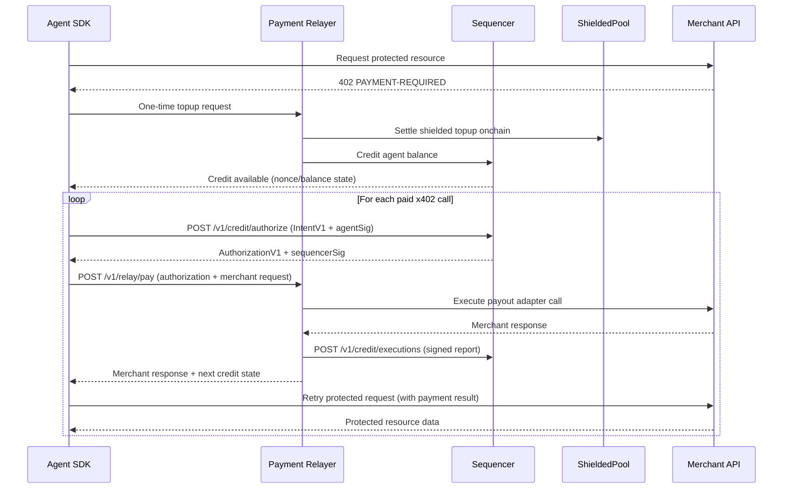

## Introduction

The Shielded x402 Client SDK (`@shielded-x402/client`) provides two complementary rails for building privacy-preserving payment agents:

1. **ShieldedClientSDK**: Anonymous proof-backed x402 payment payload construction using zero-knowledge proofs
2. **MultiChainCreditClient**: Sequencer-authorized fast execution across chain-specific relayers

## Installation

```bash
npm install @shielded-x402/client
```

### Peer Dependencies

For zero-knowledge proof generation (optional):

```bash
npm install @noir-lang/noir_js @aztec/bb.js
```

## Key Features

<CardGroup cols={2}>
  <Card title="Anonymous Payments" icon="mask">
    Generate zero-knowledge proofs for privacy-preserving x402 payments without revealing transaction history
  </Card>
  
  <Card title="Multi-Chain Support" icon="network-wired">
    Execute payments across multiple chains (Base, Solana) using sequencer-authorized credit
  </Card>
  
  <Card title="Note Management" icon="wallet">
    Local indexer for tracking shielded notes and commitments
  </Card>
  
  <Card title="Plug-and-Play" icon="plug">
    Drop-in `fetch` replacement with automatic 402 payment handling
  </Card>
</CardGroup>

## Integration Modes

### 1. Direct x402 Header Mode (Merchant-Facing)

Use `createShieldedFetch` for automatic 402 payment handling. The SDK receives `402 PAYMENT-REQUIRED`, builds the payment proof, and retries the request:

```typescript
import { createShieldedFetch, ShieldedClientSDK, LocalNoteIndexer } from '@shielded-x402/client';

const sdk = new ShieldedClientSDK({
  endpoint: RELAYER_URL,
  signer: async (message) => account.signMessage({ message })
});

const shieldedFetch = createShieldedFetch({
  sdk,
  resolveContext: async () => {
    // Return note, witness, and nullifier secret
  }
});

const res = await shieldedFetch('https://api.example.com/paid/data');
```

### 2. Relayer-Executed Mode (Agent-Facing)

Use `MultiChainCreditClient` for sequencer-authorized payments. The relayer executes the payment on behalf of the agent:

```typescript
import { MultiChainCreditClient } from '@shielded-x402/client';

const client = new MultiChainCreditClient({
  sequencerUrl: 'http://127.0.0.1:3200',
  relayerUrls: {
    'eip155:8453': 'http://127.0.0.1:3100',
    'solana:devnet': 'http://127.0.0.1:3101'
  }
});

const result = await client.pay({
  chainRef: 'eip155:8453',
  amountMicros: '1500000',
  merchant: {
    serviceRegistryId: 'demo/base',
    endpointUrl: 'https://merchant.example/pay'
  },
  merchantRequest: { /* ... */ },
  agent: { /* ... */ }
});
```

## Core Components

<CardGroup cols={2}>
  <Card title="ShieldedClientSDK" icon="shield" href="/client-sdk/shielded-client">
    Build zero-knowledge payment proofs and handle deposits/spends
  </Card>
  
  <Card title="MultiChainCreditClient" icon="coins" href="/client-sdk/multi-chain-credit">
    Execute fast credit-based payments across multiple chains
  </Card>
  
  <Card title="createShieldedFetch" icon="cloud" href="/client-sdk/shielded-fetch">
    Drop-in fetch replacement with automatic 402 handling
  </Card>
  
  <Card title="Note Management" icon="database" href="/client-sdk/note-management">
    Index and manage shielded notes locally
  </Card>
</CardGroup>

## Architecture

The SDK implements the Shielded x402 protocol with:

- **Authoritative sequencer**: Real-time nonce/balance enforcement
- **Per-chain relayers**: Execute only sequencer-authorized payments
- **Periodic commitments**: Base commitment roots for delayed independent auditability
- **Shielded settlement**: Onchain settlement as the funding source for credit balances

## Protocol Flow



## Next Steps

<CardGroup cols={2}>
  <Card title="API Reference" icon="book" href="/client-sdk/shielded-client">
    Explore detailed API documentation
  </Card>
  
  <Card title="Quickstart" icon="rocket" href="/quickstart">
    Build your first shielded payment agent
  </Card>
</CardGroup>
