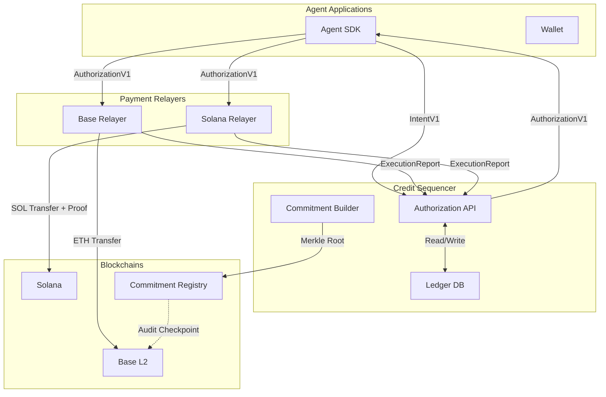

## Architecture Overview

Shielded x402 is a multi-chain credit payment system that combines:

1. **One authoritative sequencer** for real-time nonce/balance enforcement
2. **Per-chain relayers** (Base, Solana) that execute only sequencer-authorized payments
3. **Periodic Base commitment roots** for delayed independent auditability
4. **Shielded onchain settlement** as the funding source for credit balances

<Note>
No backward compatibility is retained for legacy `/v1/relay/credit/*` flows. This is a breaking MVP implementation.
</Note>

## Runtime Components

The system is split into three primary runtime components:

### 1. Credit Sequencer

**Location:** `services/credit-sequencer`

The sequencer is the authoritative source of truth for all balances and nonces. It provides:

- **Authoritative nonce/balance ledger** - Maintains the canonical state of all agent accounts
- **Signed authorizations** - Issues cryptographically signed `AuthorizationV1` payloads
- **Reclaim + execution recording** - Processes execution reports and handles expiration reclaims
- **Hourly commitment root batches** - Builds Merkle trees and posts audit checkpoints to Base

<Info>
The sequencer enforces two critical invariants:
1. Accepted authorizations have strictly increasing `agentNonce` values
2. Cumulative accepted debits never exceed cumulative credited balance
</Info>

**Key Responsibilities:**

- Enforce per-agent nonce/balance invariants in real time
- Issue signed `AuthorizationV1` payloads
- Process relayer execution reports with idempotency checks
- Handle reclaim transitions for expired issued authorizations
- Build periodic commitment epochs and optional Base postings

### 2. Payment Relayer

**Location:** `services/payment-relayer`

Chain-bound executors that perform the actual on-chain payment operations. Each relayer instance is configured for a specific chain (e.g., `eip155:8453` for Base, `solana:devnet` for Solana).

**Key Responsibilities:**

- **Verify sequencer signatures** - Validate authorization signatures before execution
- **Execute chain-specific payment actions** - Perform native transfers or smart contract calls
- **Post signed execution reports** - Report back to sequencer with cryptographically signed results

**Payout Modes:**

- `forward` - HTTP proxy to merchant endpoint
- `noop` - Synthetic hash generation for testing
- `evm` - Native EVM transfers on Base or other EVM chains
- `solana` - Solana program invocation with ZK proof verification

### 3. Base Commitment Registry

**Location:** `contracts/src/CommitmentRegistryV1.sol`

An on-chain smart contract that stores periodic audit checkpoints. This contract:

- Stores **delayed audit checkpoints only** - does not gate execution
- Records epoch commitments with `(epochId, root, count, prevRoot, sequencerKeyId)`
- Enables independent verification of authorization history

<Warning>
Base commitment roots are audit checkpoints and **do not gate relayer execution** in the MVP. Execution happens in real-time via the sequencer; commitments provide delayed auditability.
</Warning>

## Data Flow Architecture

### Authorization Flow

<Steps>
  <Step title="Agent creates intent">
    Agent SDK constructs an `IntentV1` with payment details (amount, merchant, chain reference) and signs it with the agent's private key.
  </Step>
  
  <Step title="Sequencer validates and authorizes">
    Sequencer validates the intent signature, checks balance/nonce invariants, and issues a signed `AuthorizationV1` payload.
  </Step>
  
  <Step title="Relayer executes payment">
    Chain-specific relayer verifies the sequencer signature and executes the payment on the target blockchain.
  </Step>
  
  <Step title="Execution reported back">
    Relayer posts a signed `ExecutionReportV1` back to the sequencer with the transaction hash and status.
  </Step>
</Steps>

### Commitment Flow

<Steps>
  <Step title="Sequencer builds Merkle tree">
    Hourly, the sequencer collects all authorization leaves and computes a Merkle root.
  </Step>
  
  <Step title="Root posted to Base">
    The commitment root is posted to the `CommitmentRegistryV1` contract on Base with metadata.
  </Step>
  
  <Step title="Agents retrieve proofs">
    Agents can request Merkle inclusion proofs for any authorization via `GET /v1/commitments/proof`.
  </Step>
</Steps>

## Chain Support

### Base (EVM)

**Chain Reference:** `eip155:8453` (mainnet) or `eip155:84532` (testnet)

- Native ETH transfers via relayer-controlled accounts
- Optional `noop` mode for testing (generates synthetic transaction hashes)
- Commitment registry contract deployed on Base for audit checkpoints

### Solana

**Chain Reference:** `solana:devnet` or `solana:mainnet-beta`

Solana execution requires additional zero-knowledge proof verification:

- **Noir `smt_exclusion` circuit** - Proves payer is not blacklisted
- **Sunspot Groth16 verifier** - On-chain ZK proof verifier program
- **Native Solana gateway** - CPI (Cross-Program Invocation) to verifier and SOL transfer
- Relayer reports confirmed transaction signature as `executionTxHash`

<Tip>
The Solana path demonstrates how ZK proofs can be integrated into the payment authorization flow. The `smt_exclusion` circuit is an MVP implementation; production systems would include more comprehensive proof requirements.
</Tip>

## Security Model

### Key Management

The system uses Ed25519 signature schemes throughout:

- **Sequencer signing key** - Signs all authorizations (`sequencerKeyId` included in metadata)
- **Agent signing keys** - Each agent has a keypair for signing intents
- **Relayer reporting keys** - Each relayer signs execution reports with a registered key

### Trust Boundaries

1. **Agents trust the sequencer** to maintain accurate balances and not double-spend credits
2. **Relayers trust the sequencer** to provide valid authorizations and not issue conflicting ones
3. **The system trusts relayers** to execute payments honestly and report accurate results
4. **External verifiers trust the Base commitment registry** for audit checkpoints

<Warning>
The MVP does not include slashing or fraud proofs. Relayers are assumed to be honest or operated by trusted parties. Future versions may add cryptoeconomic security.
</Warning>

## Scalability Considerations

### Real-time vs. Delayed

- **Real-time:** Sequencer authorization and relayer execution happen in milliseconds
- **Delayed:** Commitment roots are posted hourly (configurable via `SEQUENCER_EPOCH_SECONDS`)

This design allows for high-throughput payment processing without waiting for on-chain confirmations.

### Multi-chain Parallelism

Since each relayer is chain-specific, payments to different chains can be processed in parallel. An agent can have multiple in-flight authorizations across different chains simultaneously.

### Database-backed State

The sequencer uses PostgreSQL for durable state storage:

- `agents` table - Balance and nonce per agent
- `authorizations` table - All issued authorizations with status
- `executions` table - Execution reports from relayers
- `idempotency` table - Deduplication of requests

## System Diagram

## Next Steps

<CardGroup cols={2}>
  <Card title="Protocol Flow" icon="diagram-project" href="/concepts/protocol-flow">
    Learn how payments flow through the system end-to-end
  </Card>
  <Card title="Credit System" icon="coins" href="/concepts/credit-system">
    Understand credit authorization and the sequencer's role
  </Card>
</CardGroup>