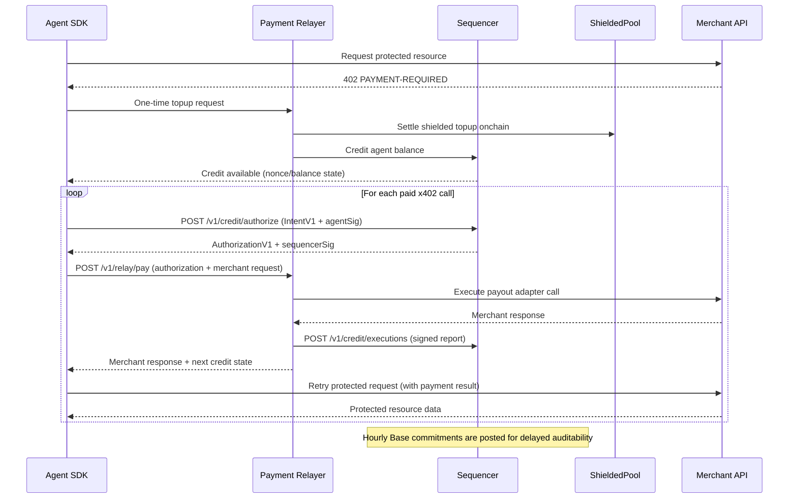
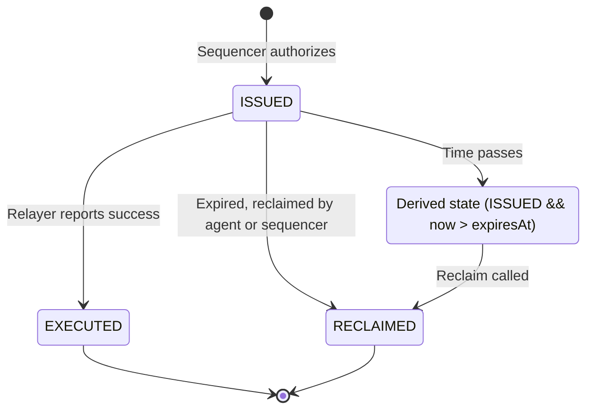

## Overview

Shielded x402 payments flow through two primary rails:

1. **Privacy Rail** - Anonymous payment construction using zero-knowledge proofs
2. **Credit Rail** - Fast multi-chain execution via sequencer-authorized credits

This page describes the complete end-to-end flow from agent request to payment settlement.

## High-Level Sequence



## Detailed Flow

The complete protocol involves multiple participants and steps:

### Phase 1: Privacy Rail (Anonymous Payment Construction)

<Steps>
  <Step title="Agent builds shielded proof">
    The agent application uses the `ShieldedClientSDK` to construct a zero-knowledge proof demonstrating ownership of a shielded note without revealing which note is being spent.
    
    **Inputs:**
    - Selected note (amount, commitment, leaf index)
    - Merkle witness proving note inclusion
    - Nullifier secret
    - Payment amount and recipient details
    
    **Outputs:**
    - ZK proof (Groth16)
    - Nullifier (prevents double-spending)
    - New output commitments (merchant payment + change)
  </Step>
  
  <Step title="Merchant gateway verifies proof">
    The merchant gateway (or relayer verify path) validates:
    - ZK proof is valid
    - Nullifier has not been seen before
    - Merkle root is current
    - Payment amount matches request
  </Step>
  
  <Step title="Shielded settlement on-chain">
    The shielded payment is settled on-chain:
    - Nullifier is recorded (prevents double-spend)
    - Output commitments are added to the tree
    - Merchant can claim their output
  </Step>
  
  <Step title="Funding signal triggers credit">
    The on-chain settlement emits a funding signal that credits the sequencer balance. This converts anonymous shielded funds into trackable credit balances.
  </Step>
</Steps>

<Note>
**Test-only shortcut:** In development environments, `POST /v1/admin/credit` can bootstrap balances without requiring shielded settlement. This endpoint should never be exposed in production.
</Note>

### Phase 2: Credit Rail (Fast Multi-Chain Execution)

<Steps>
  <Step title="Agent constructs intent">
    Using the `MultiChainCreditClient`, the agent creates an `IntentV1` message:
    
    ```typescript
    {
      agentId: "0x...",
      agentNonce: "5",
      merchantId: "sha256(service_registry_id || normalized_url)",
      amountMicros: "1500000",
      chainRef: "eip155:8453",
      expiresAt: "1735689600",
      createdAt: "1735686000"
    }
    ```
    
    The agent signs the canonical bytes of this intent with their private key.
  </Step>
  
  <Step title="Sequencer validates and authorizes">
    The sequencer (`POST /v1/credit/authorize`) performs validation:
    
    **Signature validation:**
    - Verify `agentSig` against `agentPubKey`
    - Check signature scheme matches (e.g., `ed25519-sha256-v1`)
    
    **Invariant checks:**
    - `agentNonce` must be exactly `currentNonce + 1`
    - `balance >= amountMicros` (sufficient funds)
    - `chainRef` is in supported chains list
    - `expiresAt` is in valid range (future but not too far)
    
    **Ledger updates:**
    - Insert authorization record with status `ISSUED`
    - Increment agent nonce
    - Deduct amount from balance (reserved but not yet spent)
    
    **Response:**
    The sequencer returns a signed `AuthorizationV1`:
    ```typescript
    {
      authId: "0x...",
      intent: { /* original intent */ },
      issuedAt: "1735686001",
      sequencerKeyId: "seq-key-1",
      sequencerSig: "0x..."
    }
    ```
  </Step>
  
  <Step title="Relayer receives authorization">
    The agent sends the authorization to the appropriate chain-specific relayer via `POST /v1/relay/pay`:
    
    ```json
    {
      "authorization": { /* AuthorizationV1 */ },
      "merchantRequest": {
        "url": "https://merchant.example/pay",
        "method": "POST",
        "headers": { "content-type": "application/json" },
        "bodyBase64": "eyJvcmRlcklkIjoiby0xMjMifQ=="
      }
    }
    ```
  </Step>
  
  <Step title="Relayer verifies authorization">
    Before executing, the relayer:
    
    **Verification steps:**
    - Check `authorization.intent.chainRef` matches this relayer's configured chain
    - Fetch sequencer public key for `sequencerKeyId`
    - Verify `sequencerSig` over canonical authorization bytes
    - Check authorization has not expired (`now < expiresAt`)
    
    **Idempotency check:**
    - Query sequencer for existing execution of this `authId`
    - If already executed, return cached result
  </Step>
  
  <Step title="Relayer executes payment">
    Depending on the configured payout mode:
    
    **Forward mode:**
    - HTTP request to merchant endpoint
    - Returns merchant response to agent
    
    **EVM mode:**
    - Parse `merchantRequest.bodyBase64` for recipient, amount, RPC URL
    - Sign and send native ETH transfer transaction
    - Wait for confirmation
    - Return transaction hash
    
    **Solana mode:**
    - Parse Solana-specific parameters (gateway program, verifier, proof)
    - Construct `PayAuthorized` instruction
    - Submit transaction with ZK proof verification
    - Return transaction signature
    
    **Noop mode (testing):**
    - Generate synthetic deterministic hash
    - No actual on-chain transaction
  </Step>
  
  <Step title="Relayer reports execution">
    The relayer constructs a signed execution report:
    
    ```typescript
    {
      authId: "0x...",
      chainRef: "eip155:8453",
      executionTxHash: "0xabcd...",
      status: "EXECUTED",
      reportId: "0x...",
      reportedAt: "1735686005",
      relayerKeyId: "rel-base-1",
      reportSig: "0x..."
    }
    ```
    
    This is posted to `POST /v1/credit/executions` on the sequencer.
  </Step>
  
  <Step title="Sequencer records execution">
    The sequencer:
    - Verifies `reportSig` against registered relayer public key
    - Checks `(chainRef, relayerKeyId)` match in `relayer_keys` table
    - Updates authorization status from `ISSUED` to `EXECUTED`
    - Records execution details in `executions` table
    - Marks as idempotent (subsequent reports for same `authId` are rejected)
  </Step>
  
  <Step title="Agent receives confirmation">
    The relayer returns the merchant response and execution details to the agent:
    
    ```typescript
    {
      executionTxHash: "0xabcd...",
      status: "EXECUTED",
      merchantResponse: { /* original merchant response */ },
      nextState: {
        balance: "3500000",
        nonce: "6"
      }
    }
    ```
  </Step>
</Steps>

### Phase 3: Audit Path (Verifiability)

<Steps>
  <Step title="Sequencer builds commitment epoch">
    Hourly (or per configured interval), the sequencer:
    
    - Collects all authorizations since last epoch
    - Computes authorization leaf hashes:
      ```
      authHash = H(authorization bytes)
      salt = H(sequencerSecret || authId)
      leaf = H(tag || logSeqNo || prevLeafHash || authHash || salt)
      ```
    - Builds Merkle tree and computes root
  </Step>
  
  <Step title="Post commitment root to Base">
    If Base posting is enabled, the sequencer submits a transaction to `CommitmentRegistryV1`:
    
    ```solidity
    function postCommitment(
      bytes32 root,
      uint256 count,
      bytes32 prevRoot,
      bytes32 sequencerKeyId
    ) external
    ```
    
    This creates a permanent on-chain audit checkpoint.
  </Step>
  
  <Step title="Agents fetch inclusion proofs">
    Any agent can request a Merkle proof for their authorization:
    
    ```
    GET /v1/commitments/proof?authId=0x...
    ```
    
    Response includes:
    - `epochId` - Which epoch includes this authorization
    - `leafHash` - The computed leaf hash
    - `siblings` - Merkle path siblings
    - `index` - Position in the tree
    
    Agents can verify this proof against the on-chain root to ensure their authorization was included.
  </Step>
</Steps>

<Tip>
Commitment proofs enable **delayed auditability** - agents don't need to trust the sequencer in real-time. They can later verify their authorizations were correctly included in the commitment tree.
</Tip>

## Status State Machine

Authorizations move through a strict state machine:



**Terminal states:** `EXECUTED`, `RECLAIMED`

**Reclaim rules:**

- Caller must be agent or sequencer
- Authorization must be in `ISSUED` status
- Current time must be after `expiresAt`
- One-time transition (recorded with `reclaimed_at` timestamp)
- Amount is refunded to agent balance

<Warning>
Once an authorization reaches a terminal state (`EXECUTED` or `RECLAIMED`), it cannot transition to any other state. This is enforced at the database level.
</Warning>

## Frozen Domain Tags

To ensure cryptographic stability, the protocol uses frozen domain tags for all signed messages:

1. `x402:intent:v1` - Agent intent signatures
2. `x402:authorization:v1` - Sequencer authorization signatures
3. `x402:authleaf:v1` - Authorization leaf hashing for Merkle tree
4. `x402:execution-report:v1` - Relayer execution report signatures

<Note>
These domain tags are frozen and will never change. Protocol upgrades will use new tags (e.g., `v2`) rather than modifying existing ones.
</Note>

## Integration Modes

The SDK supports two primary integration patterns:

### 1. Direct x402 Header Mode (Merchant-facing)

Use `createShieldedFetch()` for automatic 402 handling:

```typescript
const shieldedFetch = createShieldedFetch({ sdk, resolveContext });
const res = await shieldedFetch('https://api.example.com/paid/data');
```

**Flow:**
1. SDK sends GET request
2. Merchant returns `402 PAYMENT-REQUIRED` with payment details
3. SDK automatically builds `PAYMENT-SIGNATURE` header
4. SDK retries request with payment proof
5. Merchant validates and returns protected resource

### 2. Relayer-Executed Mode (Agent-facing)

Use `MultiChainCreditClient` + relayer for proxy execution:

```typescript
const result = await client.pay({
  chainRef: 'eip155:8453',
  amountMicros: '1500000',
  merchant: { ... },
  merchantRequest: { ... },
  agent: { ... }
});
```

**Flow:**
1. Agent SDK requests authorization from sequencer
2. Agent sends authorization + merchant request to relayer
3. Relayer executes payment and calls merchant
4. Relayer returns merchant response to agent

<Info>
Header mode is for direct x402 compatibility with merchant APIs. Relayer mode is for pay-and-proxy execution where the relayer acts as an intermediary.
</Info>

## Next Steps

<CardGroup cols={2}>
  <Card title="Credit System" icon="coins" href="/concepts/credit-system">
    Deep dive into credit authorization and sequencer invariants
  </Card>
  <Card title="Shielded Payments" icon="shield-halved" href="/concepts/shielded-payments">
    Learn how zero-knowledge proofs enable private payments
  </Card>
</CardGroup>