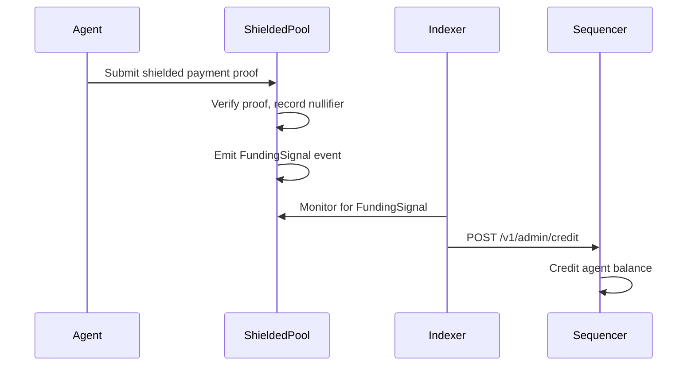

## Overview

Shielded payments enable **anonymous funding** of credit balances without revealing the payment graph. Using zero-knowledge proofs, agents can prove ownership of funds and spend them without disclosing:

- Which specific note is being spent
- The total balance of the spender
- The connection between different payments by the same user

This privacy layer is powered by **Noir circuits** compiled to Groth16 proofs, verified either on-chain or off-chain depending on the integration path.

## Core Concepts

### Shielded Notes

A shielded note represents a claim to a specific amount of value, hidden in a commitment:

```typescript
interface ShieldedNote {
  amount: bigint;           // Value in base units
  commitment: string;       // keccak256(amount || rho || pkHash)
  rho: string;              // Randomness (prevents linking)
  pkHash: string;           // Hash of owner's public key
  leafIndex: number;        // Position in Merkle tree
  nullifierSecret: string;  // Secret for computing nullifier
}
```

**Key properties:**

- **Commitment** - Cryptographic binding to amount and owner
- **Randomness (rho)** - Makes commitments unlinkable
- **Public key hash** - Proves ownership without revealing public key
- **Nullifier secret** - Enables double-spend prevention

<Info>
Notes are stored **locally by the agent** (wallet/database). The blockchain only sees commitments, not the underlying details.
</Info>

### Merkle Tree State

All shielded note commitments are stored in a Merkle tree:

```
                  Root
                 /    \
               H1      H2
              /  \    /  \
            C1   C2  C3   C4
```

**Parameters:**

- **Depth:** 24 (supports up to 16,777,216 notes)
- **Hash function:** `keccak256`
- **Leaves:** Note commitments

Agents maintain local Merkle witnesses to prove note inclusion without revealing which leaf.

### Nullifiers

Nullifiers prevent double-spending:

```typescript
const nullifier = keccak256(
  concat([
    'shielded-x402:v1:nullifier',  // domain separator
    nullifierSecret,                // agent's secret
    noteCommitment                  // commitment being spent
  ])
);
```

**Properties:**

- **Unique** - Each note has exactly one nullifier
- **Secret** - Only the note owner knows the nullifier secret
- **Binding** - Commitment + secret deterministically produce the nullifier
- **Public** - Once spent, nullifier is revealed (but doesn't reveal the note)

<Warning>
**Critical:** The nullifier secret must remain private. If leaked, an attacker could compute the nullifier for your unspent notes and frontrun your transactions.
</Warning>

## Spend_Change Circuit

The core ZK circuit enables spending one note with merchant payment + change outputs.

**Location:** `circuits/spend_change/`

### Public Inputs

These values are visible on-chain or to the verifier:

```noir
pub root: [u8; 32]              // Merkle root
pub nullifier: [u8; 32]         // Prevents double-spend
pub merchantCommitment: [u8; 32] // Payment output
pub changeCommitment: [u8; 32]  // Change output
pub challengeHash: [u8; 32]     // Binds to challenge
pub amount: u64                 // Payment amount
```

### Private Inputs

These remain secret and are never revealed:

```noir
note_amount: u64
note_rho: [u8; 32]
note_pk_hash: [u8; 32]
nullifier_secret: [u8; 32]
path_elements: [[u8; 32]; 24]   // Merkle witness
path_indices: [u1; 24]          // Left/right path
merchant_rho: [u8; 32]          // Output randomness
change_rho: [u8; 32]            // Output randomness
change_pk_hash: [u8; 32]        // Change recipient
```

### Circuit Constraints

The circuit proves the following statements without revealing private inputs:

<Steps>
  <Step title="Note commitment reconstruction">
    Prove the spent note's commitment is correctly formed:
    
    ```noir
    let input_commitment = keccak256([
      note_amount,
      note_rho,
      note_pk_hash
    ]);
    ```
  </Step>
  
  <Step title="Merkle path validity">
    Prove the input commitment exists in the tree:
    
    ```noir
    let mut current = input_commitment;
    for i in 0..24 {
      if path_indices[i] == 0 {
        current = keccak256([current, path_elements[i]]);
      } else {
        current = keccak256([path_elements[i], current]);
      }
    }
    assert(current == root);
    ```
  </Step>
  
  <Step title="Nullifier computation">
    Prove the nullifier is correctly derived:
    
    ```noir
    let computed_nullifier = keccak256([
      NULLIFIER_DOMAIN,
      nullifier_secret,
      input_commitment
    ]);
    assert(computed_nullifier == nullifier);
    ```
  </Step>
  
  <Step title="Output commitments">
    Prove output commitments are correctly formed:
    
    ```noir
    let merchant_output = keccak256([
      amount,
      merchant_rho,
      merchant_pk_hash
    ]);
    assert(merchant_output == merchantCommitment);
    
    let change_amount = note_amount - amount;
    let change_output = keccak256([
      change_amount,
      change_rho,
      change_pk_hash
    ]);
    assert(change_output == changeCommitment);
    ```
  </Step>
  
  <Step title="Balance conservation">
    Prove input equals outputs:
    
    ```noir
    assert(note_amount == amount + change_amount);
    ```
  </Step>
  
  <Step title="Challenge binding">
    Bind proof to specific payment context:
    
    ```noir
    let computed_challenge = keccak256([
      CHALLENGE_DOMAIN,
      merchantCommitment,
      amount,
      // ... other payment details
    ]);
    assert(computed_challenge == challengeHash);
    ```
  </Step>
</Steps>

<Tip>
**Output unlinkability:** The circuit uses independent randomness (`merchant_rho`, `change_rho`) for outputs, preventing linkage to the input note's `rho`. This means observers cannot tell which outputs came from the same input.
</Tip>

## Cryptographic Specification

All parameters are frozen in `packages/shared-types/src/crypto-spec.ts`.

### Hash Primitive

**Algorithm:** `keccak256`

All hashing in the circuit and client SDK uses Keccak-256 for consistency and compatibility with EVM chains.

### Merkle Tree

- **Depth:** 24 levels
- **Capacity:** 2^24 = 16,777,216 leaves
- **Hash function:** `keccak256(left || right)`
- **Empty nodes:** Zero-filled

### Note Encoding

**Scheme:** `abi-packed-v1`

```typescript
const commitment = keccak256(
  encodePacked(
    ['uint256', 'bytes32', 'bytes32'],
    [amount, rho, pkHash]
  )
);
```

### Nullifier Derivation

```typescript
const nullifier = keccak256(
  concat([
    utf8ToBytes('shielded-x402:v1:nullifier'),
    nullifierSecret,  // 32 bytes
    noteCommitment    // 32 bytes
  ])
);
```

### Domain Separators

Frozen domain tags prevent cross-protocol attacks:

| Context | Domain Tag | Hash |
|---------|-----------|------|
| Challenge | `shielded-x402:v1:challenge` | `0xe32e24a5...` |
| Commitment | `shielded-x402:v1:commitment` | - |
| Output | `shielded-x402:v1:output` | - |
| Nullifier | `shielded-x402:v1:nullifier` | - |

<Warning>
These domain separators are **frozen** and will never change. Protocol upgrades use new tags (e.g., `v2`) rather than modifying existing ones.
</Warning>

## Proof Generation Workflow

### Client-Side Flow

<Steps>
  <Step title="Select note to spend">
    Agent selects an unspent note from local storage:
    
    ```typescript
    const note = noteStore.getNotes().find(n => 
      n.amount >= paymentAmount && !n.spent
    );
    ```
  </Step>
  
  <Step title="Build Merkle witness">
    Construct the Merkle path from the note's leaf to the root:
    
    ```typescript
    const commitments = noteStore.getCommitments();
    const witness = buildWitnessFromCommitments(
      commitments,
      note.leafIndex
    );
    ```
  </Step>
  
  <Step title="Retrieve nullifier secret">
    Load the secret associated with this note:
    
    ```typescript
    const nullifierSecret = secretStore.get(note.commitment);
    ```
  </Step>
  
  <Step title="Generate output randomness">
    Create fresh randomness for merchant and change outputs:
    
    ```typescript
    const merchantRho = randomBytes(32);
    const changeRho = randomBytes(32);
    ```
  </Step>
  
  <Step title="Construct circuit inputs">
    Bundle all inputs for the prover:
    
    ```typescript
    const inputs = {
      // Public
      root: witness.root,
      nullifier: computeNullifier(nullifierSecret, note.commitment),
      merchantCommitment: computeCommitment(amount, merchantRho, merchantPkHash),
      changeCommitment: computeCommitment(changeAmount, changeRho, changePkHash),
      challengeHash: computeChallenge(paymentDetails),
      amount: amount,
      
      // Private
      note_amount: note.amount,
      note_rho: note.rho,
      note_pk_hash: note.pkHash,
      nullifier_secret: nullifierSecret,
      path_elements: witness.pathElements,
      path_indices: witness.pathIndices,
      merchant_rho: merchantRho,
      change_rho: changeRho,
      change_pk_hash: changePkHash
    };
    ```
  </Step>
  
  <Step title="Generate proof">
    Call the proof provider (Noir + barretenberg):
    
    ```typescript
    const proof = await proofProvider.generateProof(inputs);
    ```
    
    This produces a Groth16 proof (~192 bytes) that can be verified in constant time.
  </Step>
  
  <Step title="Bundle payment payload">
    Create the complete payment payload:
    
    ```typescript
    const payload = {
      proof: proof,
      root: witness.root,
      nullifier: nullifier,
      merchantCommitment: merchantCommitment,
      changeCommitment: changeCommitment,
      amount: amount,
      challengeHash: challengeHash
    };
    ```
  </Step>
</Steps>

### Proof Provider Options

**1. Client-side proving (browser/native):**

```typescript
import { BarretenbergBackend, Noir } from '@noir-lang/noir_js';

const proofProvider = {
  async generateProof(inputs) {
    const backend = new BarretenbergBackend(circuit);
    const noir = new Noir(circuit, backend);
    const { witness } = await noir.execute(inputs);
    const proof = await backend.generateProof(witness);
    return proof;
  }
};
```

**2. Remote proving service:**

```typescript
const proofProvider = {
  async generateProof(inputs) {
    const response = await fetch('https://prover.example.com/prove', {
      method: 'POST',
      body: JSON.stringify(inputs)
    });
    return response.json();
  }
};
```

<Info>
**Performance consideration:** Proving time for `spend_change` circuit is typically 1-3 seconds on modern hardware. For mobile or browser environments, consider using a remote proving service.
</Info>

## Solana ZK Integration

The Solana path includes on-chain ZK proof verification via the Sunspot verifier.

### SMT Exclusion Circuit

**Location:** `chains/solana/circuits/smt_exclusion/`

This MVP circuit proves a payer is not blacklisted:

```noir
// Simplified structure
pub fn main(
  pub blacklist_root: [u8; 32],
  pub payer_hash: [u8; 32],
  exclusion_proof: [[u8; 32]; DEPTH]
) {
  // Prove payer_hash is NOT in the sparse Merkle tree
  // with root blacklist_root
}
```

<Note>
This is a placeholder circuit for the MVP. Production systems would include more comprehensive checks (balance proofs, rate limits, etc.).
</Note>

### Sunspot Verifier Deployment

<Steps>
  <Step title="Compile circuit">
    ```bash
    cd chains/solana/circuits/smt_exclusion
    nargo compile
    ```
  </Step>
  
  <Step title="Setup and prove">
    ```bash
    sunspot setup
    sunspot prove
    ```
  </Step>
  
  <Step title="Deploy verifier program">
    ```bash
    pnpm solana:deploy:verifier
    ```
    
    This generates a Solana program that verifies Groth16 proofs for this specific circuit.
  </Step>
  
  <Step title="Deploy gateway program">
    ```bash
    pnpm solana:deploy:gateway
    pnpm solana:init:gateway
    ```
    
    The gateway program handles payment logic and makes CPI calls to the verifier.
  </Step>
</Steps>

### On-Chain Verification Flow

When a Solana payment is executed:

```rust
// Simplified gateway instruction
pub fn pay_authorized(
  ctx: Context<PayAuthorized>,
  proof: Vec<u8>,
  public_inputs: Vec<u8>,
  amount_lamports: u64
) -> Result<()> {
  // 1. CPI to Sunspot verifier
  sunspot_verifier::verify(
    ctx.accounts.verifier_program,
    &proof,
    &public_inputs
  )?;
  
  // 2. Native SOL transfer
  let ix = system_instruction::transfer(
    &ctx.accounts.payer.key(),
    &ctx.accounts.recipient.key(),
    amount_lamports
  );
  
  invoke(&ix, &[ctx.accounts.payer, ctx.accounts.recipient])?;
  
  Ok(())
}
```

<Tip>
**Gas optimization:** Groth16 proofs have constant verification time (~10-15ms) regardless of circuit complexity. This makes on-chain verification practical even on resource-constrained chains.
</Tip>

## Privacy Guarantees

### What's Hidden

- **Input notes** - Which specific note is being spent
- **Balances** - Total holdings of the spender
- **Linkability** - Connection between multiple payments by the same user
- **Sender identity** - Who owns the spent note (only public key hash is revealed)

### What's Revealed

- **Payment amount** - Visible in public inputs
- **Merchant commitment** - The payment output (but not the merchant's identity)
- **Nullifier** - Prevents double-spend (but doesn't reveal the note)
- **Merkle root** - Which version of the tree was used

<Warning>
**Metadata leakage:** Network-level metadata (IP addresses, timing) can still leak privacy. Use Tor or VPN for network anonymity.
</Warning>

## Integration with Credit System

Shielded payments serve as the **anonymous funding mechanism** for credit balances:



This design provides:

- **Privacy** - Shielded settlement doesn't reveal who is funding which credit account
- **Speed** - Once credited, payments execute instantly via the credit rail
- **Auditability** - Credit authorizations are committed to Merkle trees

## SDK Usage

### Creating Shielded Fetch

```typescript
import {
  ShieldedClientSDK,
  LocalNoteIndexer,
  buildWitnessFromCommitments,
  createShieldedFetch
} from '@shielded-x402/client';

const sdk = new ShieldedClientSDK({
  endpoint: RELAYER_URL,
  signer: async (message) => account.signMessage({ message })
});

const noteStore = new LocalNoteIndexer();
const nullifierSecrets = new Map<string, string>();

const shieldedFetch = createShieldedFetch({
  sdk,
  resolveContext: async () => {
    // Select note with sufficient balance
    const note = noteStore.getNotes().find(n => n.amount > 0n);
    if (!note) throw new Error('no spendable note');
    
    // Build Merkle witness
    const commitments = noteStore.getCommitments();
    const witness = buildWitnessFromCommitments(
      commitments,
      note.leafIndex
    );
    
    // Retrieve nullifier secret
    const nullifierSecret = nullifierSecrets.get(note.commitment);
    if (!nullifierSecret) throw new Error('missing nullifier secret');
    
    return { note, witness, nullifierSecret };
  }
});

// Use like regular fetch - SDK handles 402 payment automatically
const res = await shieldedFetch('https://api.example.com/paid/data');
const data = await res.json();
```

<Info>
Notes and nullifier secrets are **agent-local state** (wallet/database), not relayer/sequencer state. Keep them secure and backed up.
</Info>

## Next Steps

<CardGroup cols={2}>
  <Card title="Architecture" icon="diagram-project" href="/concepts/architecture">
    Review the overall system architecture
  </Card>
  <Card title="Credit System" icon="coins" href="/concepts/credit-system">
    Learn how credits enable fast multi-chain execution
  </Card>
</CardGroup>