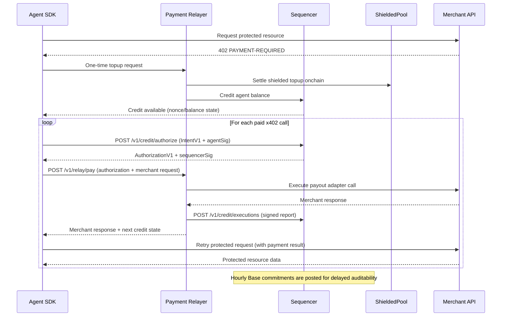

## What is Shielded x402?

Shielded x402 is a multi-chain credit protocol that enables privacy-preserving payments for HTTP APIs. Built on the x402 payment standard, it combines zero-knowledge proofs with real-time sequencer authorization to deliver fast, anonymous payments across Base and Solana—without exposing your payment graph.

The protocol breaks new ground by solving three critical challenges in web3 payments:

1. **Privacy**: Shielded settlement outputs credit balances without revealing transaction relationships
2. **Speed**: Sequencer-authorized execution delivers sub-second payment confirmation
3. **Multi-chain support**: Single credit balance works seamlessly across EVM and Solana chains

## How It Works

Shielded x402 operates on two complementary rails:

<CardGroup cols={2}>
  <Card title="Privacy Rail" icon="shield-halved">
    Anonymous proof-backed payment construction using zero-knowledge circuits. Build spend proofs with nullifiers and commitments that preserve privacy during shielded settlement.
  </Card>
  <Card title="Credit Rail" icon="bolt">
    Sequencer-authorized fast execution across chain-specific relayers. A single authoritative sequencer enforces real-time nonce and balance constraints across all chains.
  </Card>
</CardGroup>

### Architecture Overview

The system consists of three core components:

**Sequencer**: The single source of truth for credit balances and nonces. It authorizes payment intents and maintains strict ordering guarantees—accepted nonces are strictly increasing per agent, and debits never exceed credited balance.

**Chain Relayers**: Per-chain executors (`eip155:8453` for Base, `solana:devnet` for Solana) that execute only sequencer-authorized payments. Relayers call merchants on your behalf and return results directly to your application.

**Commitment Registry**: Hourly Base commitments provide delayed independent auditability. The sequencer posts merkle roots onchain, allowing anyone to verify authorization inclusion with a proof.



## Key Features

<CardGroup cols={2}>
  <Card title="Multi-Chain Native" icon="link">
    Single credit balance works across Base (EVM) and Solana networks. No bridge transactions or chain switching required.
  </Card>
  <Card title="Zero-Knowledge Privacy" icon="mask">
    Shielded settlement using Noir circuits ensures your payment graph remains private. Nullifier-based spend proofs prevent double-spending without revealing transaction history.
  </Card>
  <Card title="Real-Time Authorization" icon="gauge-high">
    Sequencer validates payment intents in milliseconds. Strict nonce ordering and balance checks enforce protocol invariants without blockchain latency.
  </Card>
  <Card title="Verifiable Commitments" icon="file-contract">
    Hourly merkle root posts to Base enable independent audit. Fetch inclusion proofs for any authorization via `/v1/commitments/proof`.
  </Card>
  <Card title="Plug-and-Play Integration" icon="plug">
    Two integration modes: direct x402 headers for merchant-facing apps, or relayer-executed mode for agent-facing workflows. Choose what fits your architecture.
  </Card>
  <Card title="Atomic Reclaim" icon="rotate-left">
    Expired authorizations automatically return credit to your balance. No funds locked in failed transactions.
  </Card>
</CardGroup>

## Integration Modes

Shielded x402 supports two distinct integration patterns:

### Direct x402 Header Mode

Use `createShieldedFetch()` for merchant-facing applications. The SDK automatically handles 402 responses, builds payment signatures, and retries requests—you receive protected data directly from the merchant.

```typescript
const shieldedFetch = createShieldedFetch({
  sdk,
  resolveContext: async () => ({
    note: getNoteFromWallet(),
    witness: buildWitness(),
    nullifierSecret: getSecret()
  })
});

// Automatic 402 handling
const res = await shieldedFetch('https://api.example.com/paid/data');
console.log(await res.text());
```

### Relayer-Executed Mode

Use `MultiChainCreditClient` for agent-facing applications. Relayers execute payments on your behalf, calling merchants and returning results through the relayer endpoint.

```typescript
const client = new MultiChainCreditClient({
  sequencerUrl: 'http://127.0.0.1:3200',
  relayerUrls: {
    'eip155:8453': 'http://127.0.0.1:3100',
    'solana:devnet': 'http://127.0.0.1:3101'
  }
});

const result = await client.pay({
  chainRef: 'eip155:8453',
  amountMicros: '1500000',
  merchant: {
    serviceRegistryId: 'demo/base',
    endpointUrl: 'https://merchant.base.example/pay'
  },
  merchantRequest: { /* ... */ },
  agent: { /* signing config */ }
});
```

## Protocol Guarantees

Shielded x402 enforces strict invariants at the protocol level:

<Note>
  **Nonce Ordering**: For each `agentId`, accepted authorizations have strictly increasing `agentNonce` values. This prevents replay attacks and ensures causal ordering.
</Note>

<Note>
  **Balance Safety**: Cumulative accepted debits never exceed cumulative credited balance. The sequencer rejects authorization requests that would violate this constraint.
</Note>

<Note>
  **State Finality**: Authorization status follows a strict state machine: `ISSUED → EXECUTED` or `ISSUED → RECLAIMED`. Terminal states are immutable.
</Note>

## Use Cases

Shielded x402 enables privacy-preserving payments for:

- **AI Agent Marketplaces**: Let autonomous agents make payments without exposing operational patterns
- **API Metering**: Charge for API calls with sub-cent precision using micros (1 micro = $0.000001 USD)
- **Content Paywalls**: Gate premium content behind x402 payment headers
- **Cross-Chain Services**: Accept payments on Base, settle on Solana—or vice versa
- **Privacy-Preserving Analytics**: Purchase data insights without revealing research interests

## What's Next?

<CardGroup cols={2}>
  <Card title="Quickstart" icon="rocket" href="/quickstart">
    Run a complete multi-chain payment flow in under 5 minutes
  </Card>
  <Card title="Installation" icon="download" href="/installation">
    Install the client and merchant SDKs in your project
  </Card>
  <Card title="Architecture" icon="sitemap" href="/concepts/architecture">
    Deep dive into sequencer design and commitment mechanisms
  </Card>
  <Card title="API Reference" icon="code" href="/api/sequencer/authorize">
    Explore sequencer and relayer endpoints
  </Card>
</CardGroup>
